Recent world events (COVID-19) has completely turned the Developer Advocacy role on its head and many of us are scrambling to find new ways to effectively reach audiences remotely.

Many of us have been reaching for tools like [Zoom](https://zoom.us) for smaller groups such as Meetups and streaming platforms like [Twitch](https://twitch.tv) / [YouTube Live](https://youtube.com) for reaching larger groups.

Many of us are turning to [Open Broadcaster Studio](https://obsproject.com/) (OBS) to turn our PCs into virtual production studios capable of composing multiple artifacts such as windows, audio, and webcams into layered streams. The most basic use case for OBS is to provide the ability to display onscreen code or a terminal session with a webcam image overlayed in the corner

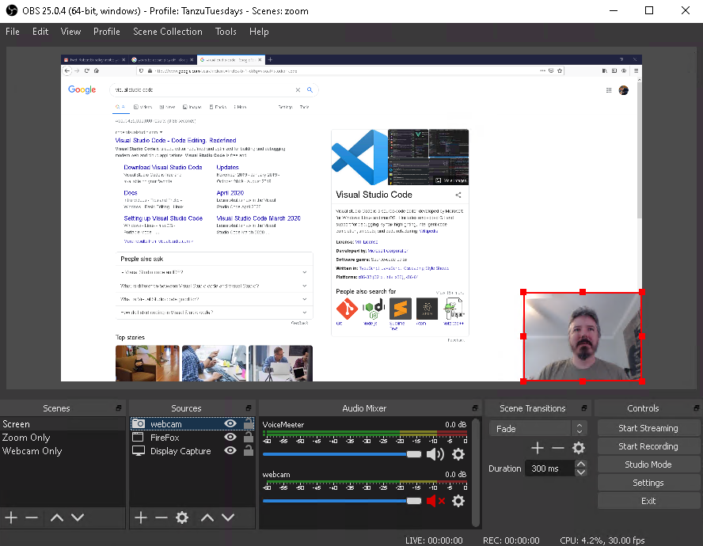

OBS can record to a high definition video file on your local machine as well as broadcast it out to Twitch, YouTube, or any other [RTSP](https://en.wikipedia.org/wiki/Real_Time_Streaming_Protocol) capable platform.

It should come as no surprise that streaming high quality video from multiple sources can be quite taxing and it often makes sense to have OBS running on a separate computer (refurbished Dell desktops are perfect for this) with a video capture device watching the primary screen.

Using OBS its fairly simple to record and broadcast a presentation, or live coding session. However it feels more like a webinar than it does a meetup or conference presentation.

Thus it makes sense to hook up Zoom and OBS in a way that you can broadcast the zoom meeting to your Stream, as well as the contents of your Stream to Zoom. This lets you not only reach multiple audiences, but it also allows your Zoom guests to interact with your Stream.

Unfortunately trying to share a screen and audio through multiple systems is complicated and isn't possible straight out of the box and we need to solve a few problems:

1. Rebroadcast video from Zoom through to your stream

2. Rebroadcast video from OBS through to Zoom

3. Mix audio from multiple inputs through to multiple outputs (without causing feedback loops)

## 1. Rebroadcast video from Zoom through to your stream

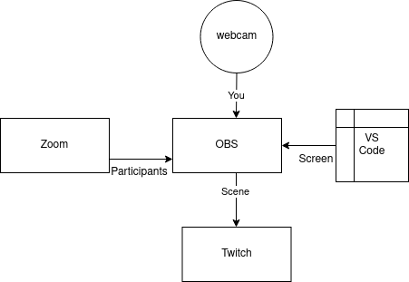

### Multiple Monitors

If you have multiple monitors you can dedicate one of them to Zoom and add a **Display Capture** source in OBS for that whole display and set zoom to fullscreen on that monitor.

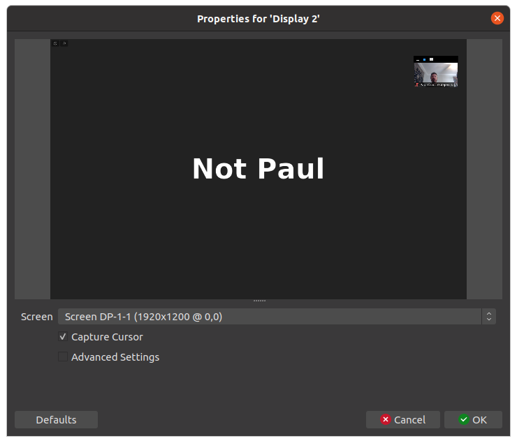

> Note: In this screenshot I only have one monitor, so you're seeing OBS in OBS cascading itself. You'd obviously set the display to your secondary monitor.

However I'm not a fan of the layout of fullscreen zoom calls, so I prefer to capture it as a window, which also means its possible to do this with a single monitor.

### Single Monitor / Window Capture

In OBS you can add a **Window Capture** and select your Zoom meeting. This will capture just the Zoom window itself. You can adjust the window size to suit the resolution that you're outputting to.

Zoom likes to switch to fullscreen when you (or somebody else) shares their screen. Make sure to deselect the **Enter full screen when a participant shares screen** in the **Share Screen** Settings to disable this behavior.

You might be tempted to try and share your screen to Zoom, however Zoom behaves painfully when you do that and you'll most likely lose your capture of the Zoom window. Instead you might want to add the OBS virtual camera which lets you use the contents of your OBS scene as a camera in Zoom.

## 2. Rebroadcast video from OBS through to Zoom

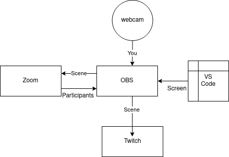

OBS has a plugin that lets you create a virtual camera which you can then use as your Zoom camera. This means that the people in your Zoom call will see exactly the same video that you're streaming without having to share your screen.

You can download the virtual camera plugin from [here](https://obsproject.com/forum/resources/obs-virtualcam.949/) however it currently only supports Windows. (There's a [video4linux](https://github.com/CatxFish/obs-v4l2sink) you can use if you're on Linux) for the same effect.

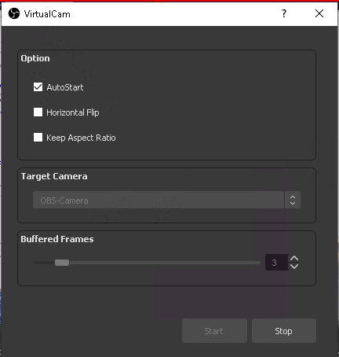

With the Virtual Camera plugin installed and enabled you can the select it as a camera in Zoom.

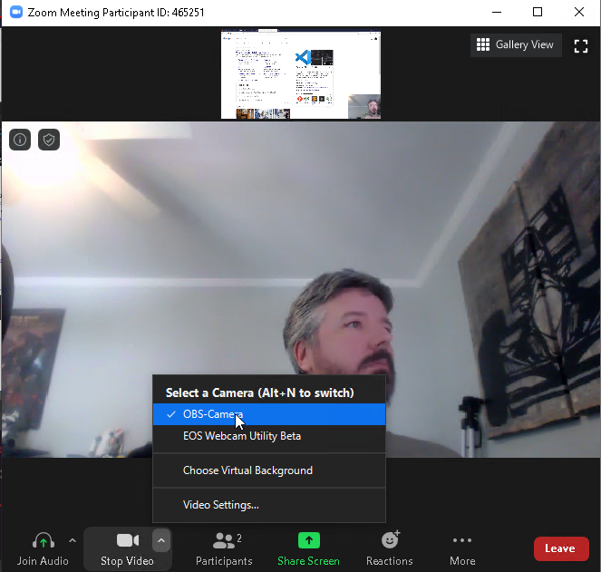

> You can see the remote camera now showing the host's OBS scene of their webcam nested with their screen share.

## 3. Mix audio from multiple inputs through to multiple outputs

*Without causing feedback loops.*

Setting up the video was relatively straight forward. Audio is the complicated beast. So far I have only solved this on Windows, but am quite certain you could solve it in Linux using the [JACK Audio Connection Kit](https://jackaudio.org/) (JACK).

Basically we need to be able to selectively route certain inputs to certain outputs. For instance we want zoom audio to go into OBS, and we want OBS audio to go into Zoom, but we don't want them to loop eachothers audio back and create a feedback loop.

In order to solve this, you need a Mixer that can mix three discreet inputs (Zoom, Desktop, Mic) to three discreet outputs (Speakers, Zoom, OBS).

You also need virtual audio devices that can act as patch cables.

There's likely a number of different audio solutions out there to solve this, I'll show you what I found works really well and while not free, is extremely affordable.

This is where [VB Audio](https://www.vb-audio.com/) comes in. It's a website with an interesting assortment of audio software for Windows, most of which is either Free or Donationware (read the licenses carefully before using it in a commercial setting).

[VB Audio](https://www.vb-audio.com/) offers [virtual cables](https://www.vb-audio.com/Cable/index.htm) that we can use to patch the sound correctly. They have up to 5 cables that you can purchase via Donation. In order to wire up our sound we'll use **VB-CABLE A+B** and **VB-CABLE C+D** which gives us 4 virtual cables.

All audio sent to VB-CABLE inputs is sent to the correspnding VB_CABLE output.

Pay for, download, and install both bundles.

You will still need a Mixer capable of mixing the inputs correctly. Thankfully [VB Audio](https://www.vb-audio.com/) also provides [VoiceMeeter](https://www.vb-audio.com/Voicemeeter/index.htm). It comes in three flavors, [VoiceMeeter](https://www.vb-audio.com/Voicemeeter/index.htm), [VoiceMeeter Banana](https://www.vb-audio.com/Voicemeeter/banana.htm), and [VoiceMeeter Potato](https://www.vb-audio.com/Voicemeeter/potato.htm).

The regular VoiceMeeter does not have enough inputs and outputs, so you'll want to use either Banana or Potato. I used Banana as it has exactly the right number of inputs.

Pay for (Donate), download and install [VoiceMeeter Banana](https://www.vb-audio.com/Voicemeeter/banana.htm).

Now you have the Mixer and the Virtual Cables we can hook everything up together.

### Configure VoiceMeeter Banana

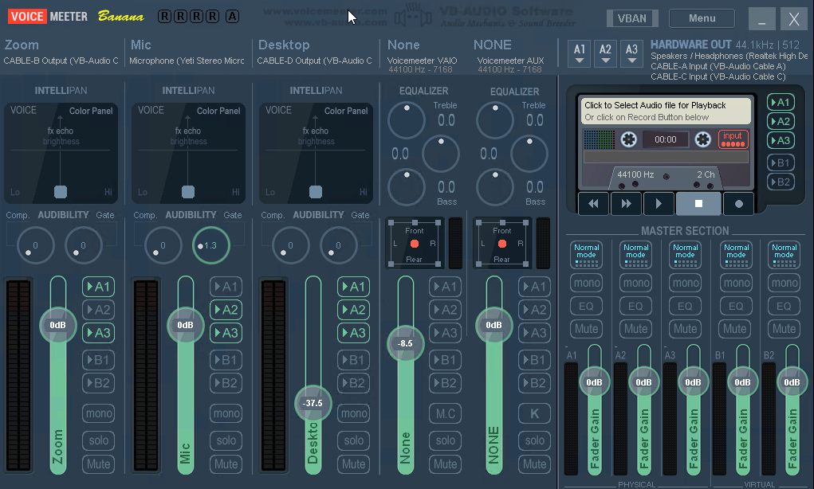

First open up VoiceMeeter Banana. You'll see there are Three Hardware Inputs and Three Hardware outputs.

**Hardware Inputs:**

*You can rename the Inputs by right clicking on their names, and you can select their devices underneath.*

* Rename **Hardware input 1** to **Zoom** and set it to **WDB: CABLE-B Output**.

* Rename **Hardware input 2** to **Mic** and set it to your microphone device. Mine is **Microphone (Yeti)**.

* Rename **Hardware input 3** to **Desktop**and set it to **WDB: CABLE-D Output**.

**Hardware Outputs:**

*Set the outputs by clicking the A1, A2, A3 dropdowns next to where it says **HARDWARE OUT***

* A1 -> **Speakers / Headphones**
* A2 -> **WDM: Cable-A Input** (Zoom)
* A3 -> **WDM: Cable-C Input** (OBS)

**Mixing:**

*Under the Hardware Inputs you can see a Volume selector and a sound activity bar. Beside that you can see options, the outputs to send to as well as Mute.*

* Zoom -> A1 (Speakers), A3 (OBS)
* Mic -> A1 (Speakers), A2 (Zoom), A3 (OBS)
* Desktop -> A1 (Speakers), A2 (Zoom), A3 (OBS)

*I usually set the **Desktop** audio volume to about `-33` so that random noises don't drown out people speaking.

### Configure Desktop Audio

In your status bar select the **Speaker** Icon and configure it to output to **Cable-D Input**

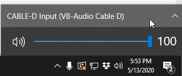

### Configure Zoom audio

In Zoom, go to **Audio Settings**. Set **Speaker** to **Cable-B Input** and set **Microphone** to **Cable-A Output**.

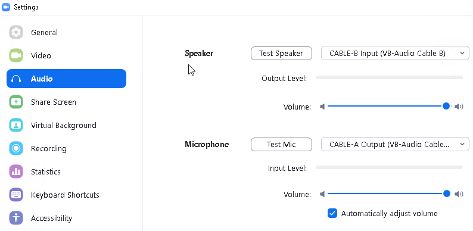

### Configure OBS settings

in OBS under **Settings**->**Audio** Disable all Audio devices. Then set **Mic/Auxillary Input** to **CABLE-C Output**.

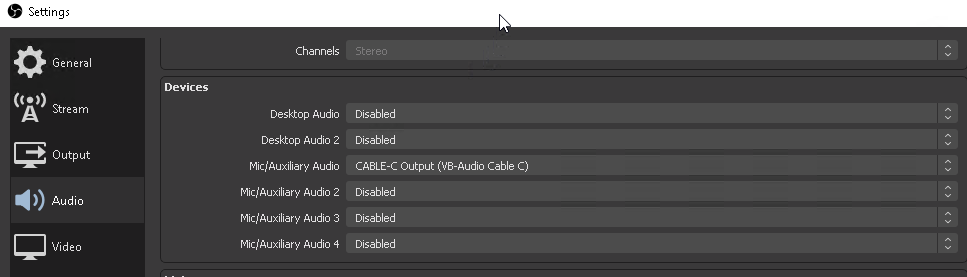

Then in the OBS **Audio Mixer** rename the **Mic/Auxillary Input** to **VoiceMeeter** and mute all other devices such as webcams.

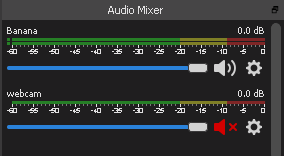

### Test it out

You should now have everything wired up correctly and just need to test it out.

When you configured the Mic input in VoiceMeeter you chose to send it to all three outputs. This means that you should hear your Mic input through your speakers/headphones.

If you don't like to listen to yourself you can deselect **A1** for the **Mic** input. This is an easy toggle to see if the audio is working.

You can also use the volume meters in the various apps to confirm they match. For instance when you speak in the Microphone you should see the **Mic** meter, and the **A1**, **A2**, **A3** meter move at the same time. You should also see activity in the OBS mixer and Zoom.

You should hit **Start Recording** in OBS and get on a zoom with a friend (or a second computer) and verify sound is working in both directions, and that all of the audio ends up in the OBS recording.

## Conclusion

Assuming you didn't hit any issues following this guide you now have your system configured to Stream to both Twitch (or YouTube) and Zoom at the same time, mixing their audio and video appropriately.

This gives you a powerful way to not just record content, but to stream it and share it with both intimate groups on Zoom and Larger audiences on Twitch.

One of the best parts of this setup is how I can easily host someone else on my twitch stream and have them share their desktop and do demos, live coding etc.

I can also run workshops through zoom and people on my twitch stream can also follow along.
