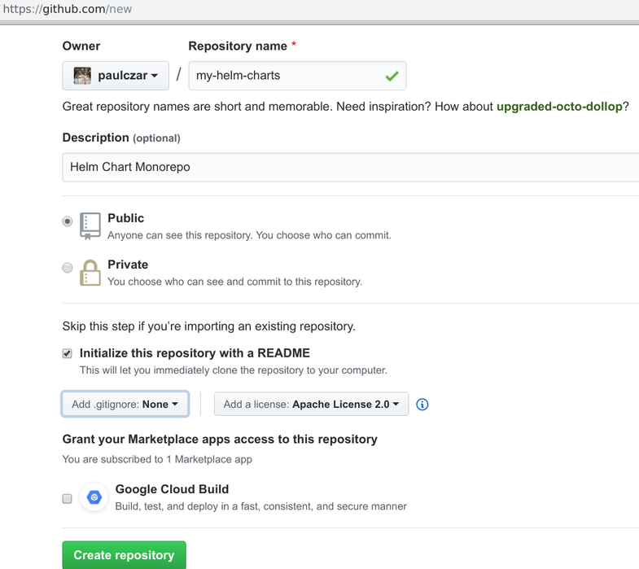
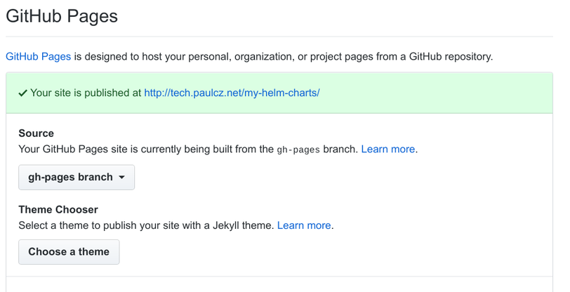
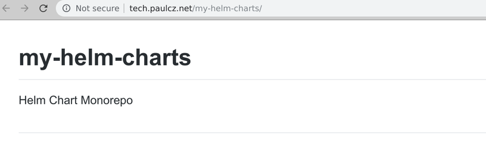
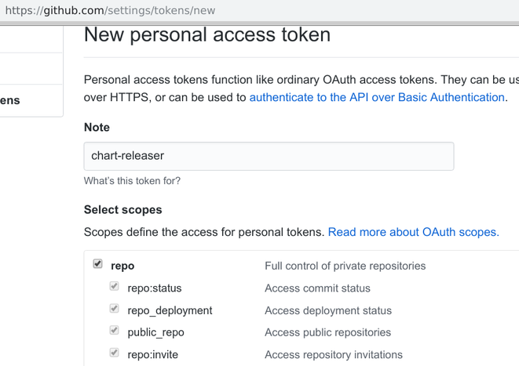
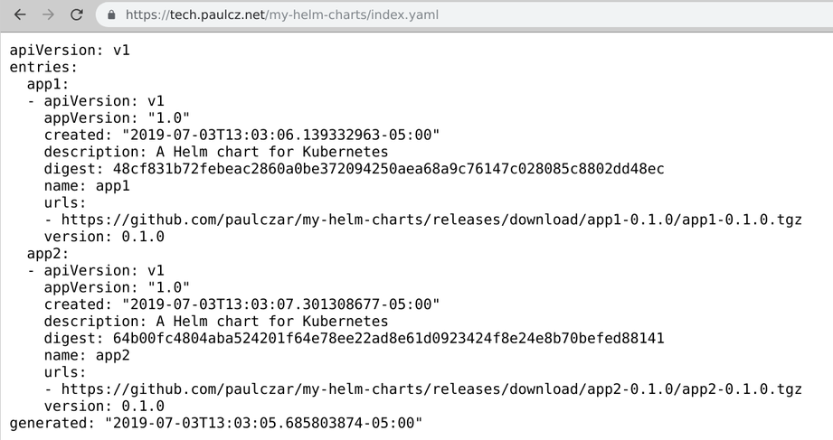

## Introduction

Welcome to a three part blog series on Creating a Helm Chart Repository. In **part 1** I will demonstrate creating a helm chart repository using GitHub and GitHub Pages. In [part 2](/blog/creating-a-helm-chart-monorepo-part-2) I will add Automation to automatically update the repository, and in [part 3](/blog/creating-a-helm-chart-monorepo-part-3) I will add testing for changes to the charts themselves.


Helm is the defacto tool for packaging, sharing, and running Kubernetes Manifests. I'm going to assume you know the basics of Helm and have used it before. There's plenty of great introductory topics around.

You can host and share Helm Charts (packages) via a Helm Repository which is effectively a static website with an `index.yaml` providing metadata and links to the Helm Packages.

This makes hosting a repository perfectly suited to running in GitHub pages, s3, google cloud storage, etc. I like to use GitHub pages as it allows your source code and repo to live effectively in the same place.

I will walk you through creating a new GitHub project hosting multiple helm charts and demonstrate how to set up Continuous Integration with CircleCI to automatically test and publish new changes to your Helm Charts.

## Create a new GitHub Repository

Log into GitHub and [create a new repository](https://github.com/new) called `my-helm-charts`. I chose to have GitHub create it as with an Apache2 License.



You can now clone down this repository and get to work:

```bash
$ git clone git@github.com:paulczar/my-helm-charts.git
Cloning into 'my-helm-charts'...
remote: Enumerating objects: 4, done.
remote: Counting objects: 100% (4/4), done.
remote: Compressing objects: 100% (3/3), done.
remote: Total 4 (delta 0), reused 0 (delta 0), pack-reused 0
Receiving objects: 100% (4/4), 4.52 KiB | 4.52 MiB/s, done.

$ cd my-helm-charts

$ tree
.
├── LICENSE
└── README.md

0 directories, 2 files
```

You can see we have a default LICENSE file and a default README.md, we can leave them alone for now. Your next step is to create a couple of Helm charts. Since this is purely for demonstration purposes they don't have to be overly functional charts which means we can just use the default boilerplate created by `helm create`.

> You do have [helm](https://github.com/helm/helm#install) installed right?

```bash
$ mkdir charts

$ helm create charts/app1
Creating charts/app1

$ helm create charts/app2
Creating charts/app2

$ tree
.
├── charts
│   ├── app1
│   │   ├── charts
│   │   ├── Chart.yaml
│   │   ├── templates
│   │   │   ├── deployment.yaml
│   │   │   ├── _helpers.tpl
│   │   │   ├── ingress.yaml
│   │   │   ├── NOTES.txt
│   │   │   ├── service.yaml
│   │   │   └── tests
│   │   │       └── test-connection.yaml
│   │   └── values.yaml
│   └── app2
│       ├── charts
│       ├── Chart.yaml
│       ├── templates
│       │   ├── deployment.yaml
│       │   ├── _helpers.tpl
│       │   ├── ingress.yaml
│       │   ├── NOTES.txt
│       │   ├── service.yaml
│       │   └── tests
│       │       └── test-connection.yaml
│       └── values.yaml
├── LICENSE
└── README.md

9 directories, 18 files
```

Push these changes to git:

```bash
echo ".deploy" >> .gitignore

$ git add .

$ git commit -m 'Initial Commit'
[master 2172141] Initial Commit
 18 files changed, 524 insertions(+)
...
...

$ git push origin master
Enumerating objects: 27, done.
Counting objects: 100% (27/27), done.
Delta compression using up to 4 threads
Compressing objects: 100% (24/24), done.
Writing objects: 100% (26/26), 4.72 KiB | 536.00 KiB/s, done.
Total 26 (delta 8), reused 0 (delta 0)
remote: Resolving deltas: 100% (8/8), done.
To github.com:paulczar/my-helm-charts.git
   abdcced..2172141  master -> master
```


## Publish your Helm Repository

### Prepare GitHub Pages

We're going to use a combination of GitHub pages and releases to host our Helm Repository. Therefore we need to ensure we have GitHub pages enabled on the git repo and to create an empty `gh-pages` branch.

You can create an empty `gh-pages` branch by creating an orphan branch like so:

```
$ git checkout --orphan gh-pages
Switched to a new branch 'gh-pages'

$ rm -rf charts

$ git add . --all

$ git commit -m 'initial gh-pages'
git commit -m 'initial gh-pages'
[gh-pages a9ce382] initial gh-pages
 18 files changed, 524 deletions(-)
...
...

$ git push origin gh-pages
Enumerating objects: 3, done.
...
...
To github.com:paulczar/my-helm-charts.git
 * [new branch]      gh-pages -> gh-pages
```

Next check that GitHub pages is enabled by clicking on your git repo settings in GitHub:



> Note: I have a custom domain set up, your URL will probably be username.github.io/my-helm-charts.

After a few minutes you should have a default rendering on your README.md at the provided URL:



### Introducing chart-releaser

You could use a combination of `helm package` and `helm repo` commands to construct your Helm repository by hand, or you can simplify your life by using `chart-releaser` which will not only create your packages, but will upload them as binaries into an appropriately versioned GitHub release.

Download chart-releaser for your architecture [here].

> Note: I'm doing this on a linux machine, so you may need to update the commands below for Mac OS.

In a new terminal download and unpackage it, moving it to an executable path:

```bash
cd /tmp
$ curl -sSL https://github.com/helm/chart-releaser/releases/download/v0.2.1/chart-releaser_0.2.1_linux_amd64.tar.gz | tar xzf -

$ mv cr ~/bin/cr

$ cr help
Create Helm chart repositories on GitHub Pages by uploading Chart packages
and Chart metadata to GitHub Releases and creating a suitable index file

Usage:
  cr [command]

Available Commands:
  help        Help about any command
  index       Update Helm repo index.yaml for the given GitHub repo
  upload      Upload Helm chart packages to GitHub Releases
  version     Print version information

Flags:
      --config string   Config file (default is $HOME/.cr.yaml)
  -h, --help            help for cr

Use "cr [command] --help" for more information about a command.
```

There are two commands we care about `cr index` and `cr upload`, the first will create an appropriate `index.yaml` and the second will upload the packages to GitHub releases. In order to do the latter you'll need to pass it in a GitHub token so that it can use the GitHub APIs.

In your browser go to your [github developer settings](https://github.com/settings/tokens) and create a new personal access token.



Create an environment variable (or a `~/.cr.yaml` config file) containing the access token:

> Pro-tip: put an additional space in your command right before ` export` and it won't be saved to your command history.

```bash
$  export CH_TOKEN=c4a4ed6ab91a246572b0c46c19c630ccadc1049
```

### Create and Upload Helm Packages

Your next step is to create and upload the packages:

```bash
$ helm package charts/{app1,app2} --destination .deploy
Successfully packaged chart and saved it to: .deploy/app1-0.1.0.tgz
Successfully packaged chart and saved it to: .deploy/app2-0.1.0.tgz
```

Run `cr upload` to create releases and upload the packages, note if it runs correctly there's no output.

```bash
$ cr upload -o paulczar -r my-helm-charts -p .deploy
```

Check your github repository now has a releases page with two releases:


### Create and upload index file to GitHub pages

Checkout your `gh-pages` branch and run `cr index`:

```bash
$ git checkout gh-pages

$ cr index -i ./index.yaml -p .deploy --owner paulczar --repo my-helm-charts
====> UpdateIndexFile new index at ./index.yaml
====> Found app1-0.1.0.tgz
====> Extracting chart metadata from .deploy/app1-0.1.0.tgz
====> Calculating Hash for .deploy/app1-0.1.0.tgz
====> Found app2-0.1.0.tgz
====> Extracting chart metadata from .deploy/app2-0.1.0.tgz
====> Calculating Hash for .deploy/app2-0.1.0.tgz
--> Updating index ./index.yaml
```

There should now be a `index.yaml` file containing the details of your helm packages and the path to their archive:

```bash
$ cat index.yaml
apiVersion: v1
entries:
  app1:
  - apiVersion: v1
    appVersion: "1.0"
    created: "2019-07-03T13:03:06.139332963-05:00"
    description: A Helm chart for Kubernetes
    digest: 48cf831b72febeac2860a0be372094250aea68a9c76147c028085c8802dd48ec
    name: app1
    urls:
    - https://github.com/paulczar/my-helm-charts/releases/download/app1-0.1.0/app1-0.1.0.tgz
    version: 0.1.0
  app2:
  - apiVersion: v1
    appVersion: "1.0"
    created: "2019-07-03T13:03:07.301308677-05:00"
    description: A Helm chart for Kubernetes
    digest: 64b00fc4804aba524201f64e78ee22ad8e61d0923424f8e24e8b70befed88141
    name: app2
    urls:
    - https://github.com/paulczar/my-helm-charts/releases/download/app2-0.1.0/app2-0.1.0.tgz
    version: 0.1.0
generated: "2019-07-03T13:03:05.685803874-05:00"
```

Commit this to git and then wait a few minutes and check that it exists in your GitHub pages url:

```bash
$ git add index.yaml

$ git commit -m 'release 0.1.0'
[gh-pages 696df18] release 0.1.0
 1 file changed, 23 insertions(+)
 create mode 100644 index.yaml

$ git push origin gh-pages
...
To github.com:paulczar/my-helm-charts.git
   75f1fe8..696df18  gh-pages -> gh-pages
```

Check it exists in GitHub pages:



### Test your new Helm Repostiory

> Note: To do this you'll need a Kubernetes cluster with Helm's tiller installed, but you already know how to do that right?

```
$ helm repo add my-helm-charts https://tech.paulcz.net/my-helm-charts
"my-helm-charts" has been added to your repositories

$ helm install --name test --namespace test my-helm-charts/app1
NAME:   test
LAST DEPLOYED: Wed Jul  3 13:17:32 2019
NAMESPACE: test
STATUS: DEPLOYED

RESOURCES:
==> v1/Deployment
NAME       READY  UP-TO-DATE  AVAILABLE  AGE
test-app1  0/1    1           0          0s

==> v1/Pod(related)
NAME                        READY  STATUS             RESTARTS  AGE
test-app1-7b575d95f6-zhlh2  0/1    ContainerCreating  0         0s

==> v1/Service
NAME       TYPE       CLUSTER-IP      EXTERNAL-IP  PORT(S)  AGE
test-app1  ClusterIP  10.100.200.213  <none>       80/TCP   0s


NOTES:
1. Get the application URL by running these commands:
  export POD_NAME=$(kubectl get pods --namespace test -l "app.kubernetes.io/name=app1,app.kubernetes.io/instance=test" -o jsonpath="{.items[0].metadata.name}")
  echo "Visit http://127.0.0.1:8080 to use your application"
  kubectl port-forward $POD_NAME 8080:80
```

Check that it deployed ok:

```bash
$ kubectl -n test get all
NAME                             READY   STATUS    RESTARTS   AGE
pod/test-app1-7b575d95f6-zhlh2   1/1     Running   0          42m

NAME                TYPE        CLUSTER-IP       EXTERNAL-IP   PORT(S)   AGE
service/test-app1   ClusterIP   10.100.200.213   <none>        80/TCP    42m

NAME                        READY   UP-TO-DATE   AVAILABLE   AGE
deployment.apps/test-app1   1/1     1            1           42m

NAME                                   DESIRED   CURRENT   READY   AGE
replicaset.apps/test-app1-7b575d95f6   1         1         1       42m
```

Clean up:

```bash
$ helm delete --purge test
release "test" deleted
```

### Update the README.md with instructions on using

switch back to your `master` brach:

```bash
$ git checkout master
```

Edit your README.md to provide details on how to use charts from your repository:

```markdown
# My Helm Charts

This repository contains Helm charts for various projects

* [Application 1](charts/app1/)
* [Application 2](charts/app2/)

## Installing Charts from this Repository

Add the Repository to Helm:

    helm repo add my-helm-charts https://tech.paulcz.net/my-helm-charts

Install Application 1:

    helm install my-helm-charts/app1

Install Application 2:

    helm install my-helm-charts/app2
```

Commit the change up to GitHub:

```bash
$ git add README.md
$ git commit -m 'update readme with instructions'
$ git push origin master
...
```

## Conclusion

That's the end of **Part 1** of this three part series. In future posts I will demonstrate adding [automation](/blog/creating-a-helm-chart-monorepo-part-2) and [testing](/blog/creating-a-helm-chart-monorepo-part-3) to this Helm chart repository.
