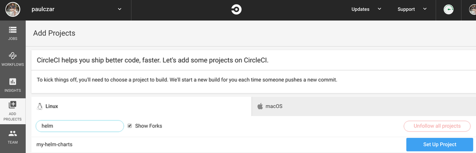
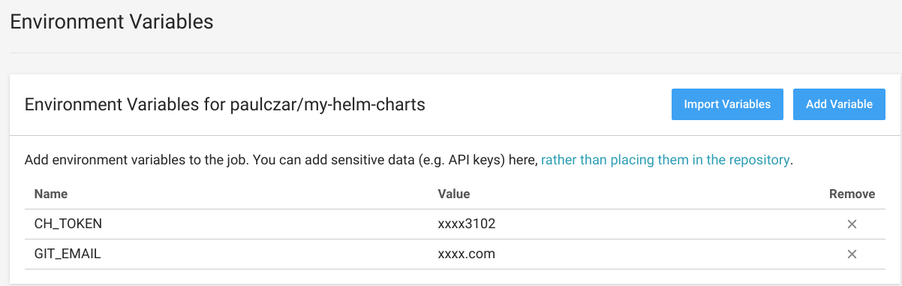
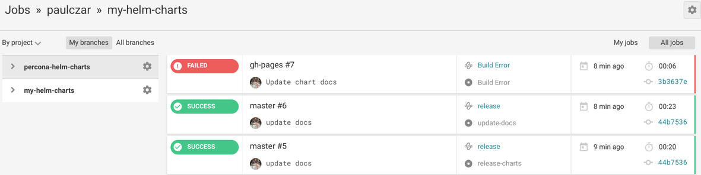

## Introduction

Welcome to a three part blog series on Creating a [Helm](https://helm.sh) Chart Repository. In [part 1](/blog/creating-a-helm-chart-monorepo-part-1) of this series I demonstrated creating a [Helm](https://helm.sh) chart repository using [GitHub](https://github.com)and [GitHub](https://github.com)Pages. In this **part 2** I will add Automation to automatically update the repository, and in [part 2](/blog/creating-a-helm-chart-monorepo-part-3) I will add testing for changes to the charts themselves.

## Use Circle CI to automate [Helm](https://helm.sh) Chart Updates

> Note - You could use any other CI system here, I chose Circle as it is easy to integrate with [GitHub](https://github.com)and has a free tier. If you do use a different CI system the scripts should still work, but you'll need to rewrite a config file suitable for your CI choice.

Now that we've successfully created a [Helm](https://helm.sh) Chart Repostiory using [GitHub](https://github.com)and [GitHub](https://github.com)pages we can move on to adding some Automation so that our Chart Repository is updated any time we push changes up to our master branch.

Its pretty easy to create a new Circle CI account. You simply go to their website and hit [sign-up](https://circleci.com/signup/), it will ask you to log using [GitHub](https://github.com)Oauth2 and once you've given it access to your repositories you are good to go.

Once logged in you need to hit the **ADD Projects** menu item and hit the **set up project** button next to **my-helm-charts**.



You can leave the defaults and just go down and click the **Start Building** button.

It will attempt to run and fail because you don't have a `.circleci/config.yml` file in your repo yet. We'll create that soon.

Before we do that though we need to create a private key for Circle CI with write access to our project. Hit the **settings** button on the top right of the **Workflows -> username -> my-helm-charts** screen tat looks like a little cog.

From here you want to hit SSH permissions and hit **Checkout SSH Keys**.

There should be a **Add user key** section with a button that says **Authorize with GitHub**, hit that button. To be extra certain it loads the same page and you need to click the **Create and add [username] user key** which will create a key and pass the public key off to github.

On that same **settings** page you need to add some environment variables:



Now its time to set up our Automation.

### Create Circle CI config for uploading new packages

Create a new directory `.circleci` and a file inside that called `config.yml`:

```bash
$ mkdir .circleci
$ touch .circleci/config.yml
```

Write out the `config.yml` file like so:

> Note: this CircleCI config file creates two jobs, One to lint the shell scripts we're about to create, the other to release charts and copy documentation into our [Helm](https://helm.sh) repo website. These tasks will run when code is pushed or merged into the `master` branch.

#### [.circleci/config.yml](https://github.com/paulczar/my-helm-charts/blob/part-2/.circleci/config.yml)

```yaml
version: 2
jobs:
  lint-scripts:
    docker:
      - image: koalaman/shellcheck-alpine
    steps:
      - checkout
      - run:
          name: lint
          command: shellcheck -x .circleci/*.sh
  release-charts:
    machine: true
    steps:
      - checkout
      - run:
          command: |
            echo "export GIT_REPOSITORY_URL=$CIRCLE_REPOSITORY_URL" >> $BASH_ENV
            echo "export GIT_USERNAME=$CIRCLE_PROJECT_USERNAME" >> $BASH_ENV
            echo "export GIT_REPOSITORY_NAME=$CIRCLE_PROJECT_REPONAME" >> $BASH_ENV
            .circleci/install_tools.sh
            .circleci/release.sh

workflows:
  version: 2
  release:
    jobs:
      - lint-scripts
      - release-charts:
          filters:
            tags:
              ignore: /.*/
            branches:
              only: master
```

We referenced two scripts in the `config.yml` file, so we better create those. These scripts are a mix of ones that I have written, and have borrowed from others in the [Helm Community](https://github.com/codecentric/helm-charts/blob/master/.circleci/release.sh).

#### [.circleci/install_tools.sh](https://github.com/paulczar/my-helm-charts/blob/part-2/.circleci/install_tools.sh)

```bash
#!/usr/bin/env bash

set -o errexit

readonly HELM_VERSION=2.13.1
readonly CHART_RELEASER_VERSION=0.1.4

echo "Installing Helm..."
curl -LO "https://kubernetes-helm.storage.googleapis.com/helm-v$HELM_VERSION-linux-amd64.tar.gz"
sudo mkdir -p "/usr/local/helm-v$HELM_VERSION"
sudo tar -xzf "helm-v$HELM_VERSION-linux-amd64.tar.gz" -C "/usr/local/helm-v$HELM_VERSION"
sudo ln -s "/usr/local/helm-v$HELM_VERSION/linux-amd64/helm" /usr/local/bin/helm
rm -f "helm-v$HELM_VERSION-linux-amd64.tar.gz"
helm init --client-only

echo "Installing chart-releaser..."
curl -LO "https://github.com/helm/chart-releaser/releases/download/v${CHART_RELEASER_VERSION}/chart-releaser_${CHART_RELEASER_VERSION}_Linux_x86_64.tar.gz"
sudo mkdir -p "/usr/local/chart-releaser-v$CHART_RELEASER_VERSION"
sudo tar -xzf "chart-releaser_${CHART_RELEASER_VERSION}_Linux_x86_64.tar.gz" -C "/usr/local/chart-releaser-v$CHART_RELEASER_VERSION"
sudo ln -s "/usr/local/chart-releaser-v$CHART_RELEASER_VERSION/chart-releaser" /usr/local/bin/chart-releaser
rm -f "chart-releaser_${CHART_RELEASER_VERSION}_Linux_x86_64.tar.gz"
```

#### [.circleci/release.sh](https://github.com/paulczar/my-helm-charts/blob/part-2/.circleci/release.sh)

```bash
#!/usr/bin/env bash

set -o errexit
set -o nounset
set -o pipefail

: "${CH_TOKEN:?Environment variable CH_TOKEN must be set}"
: "${GIT_REPOSITORY_URL:?Environment variable GIT_REPO_URL must be set}"
: "${GIT_USERNAME:?Environment variable GIT_USERNAME must be set}"
: "${GIT_EMAIL:?Environment variable GIT_EMAIL must be set}"
: "${GIT_REPOSITORY_NAME:?Environment variable GIT_REPOSITORY_NAME must be set}"

readonly REPO_ROOT="${REPO_ROOT:-$(git rev-parse --show-toplevel)}"

main() {
    pushd "$REPO_ROOT" > /dev/null

    echo "Fetching tags..."
    git fetch --tags

    local latest_tag
    latest_tag=$(find_latest_tag)

    local latest_tag_rev
    latest_tag_rev=$(git rev-parse --verify "$latest_tag")
    echo "$latest_tag_rev $latest_tag (latest tag)"

    local head_rev
    head_rev=$(git rev-parse --verify HEAD)
    echo "$head_rev HEAD"

    if [[ "$latest_tag_rev" == "$head_rev" ]]; then
        echo "No code changes. Nothing to release."
        exit
    fi

    rm -rf .deploy
    mkdir -p .deploy

    echo "Identifying changed charts since tag '$latest_tag'..."

    local changed_charts=()
    readarray -t changed_charts <<< "$(git diff --find-renames --name-only "$latest_tag_rev" -- charts | cut -d '/' -f 2 | uniq)"

    if [[ -n "${changed_charts[*]}" ]]; then
        for chart in "${changed_charts[@]}"; do
            echo "Packaging chart '$chart'..."
            package_chart "charts/$chart"
        done

        release_charts
        sleep 5
        update_index
    else
        echo "Nothing to do. No chart changes detected."
    fi

    popd > /dev/null
}

find_latest_tag() {
    if ! git describe --tags --abbrev=0 2> /dev/null; then
        git rev-list --max-parents=0 --first-parent HEAD
    fi
}

package_chart() {
    local chart="$1"
    Helm dependency build "$chart"
    Helm package "$chart" --destination .deploy
}

release_charts() {
    chart-releaser upload -o "$GIT_USERNAME" -r "$GIT_REPOSITORY_NAME" -p .deploy
}

update_index() {
    chart-releaser index -o "$GIT_USERNAME" -r "$GIT_REPOSITORY_NAME" -p .deploy/index.yaml

    git config user.email "$GIT_EMAIL"
    git config user.name "$GIT_USERNAME"

    for file in charts/*/*.md; do
        if [[ -e $file ]]; then
            mkdir -p ".deploy/docs/$(dirname "$file")"
            cp --force "$file" ".deploy/docs/$(dirname "$file")"
        fi
    done

    git checkout gh-pages
    cp --force .deploy/index.yaml index.yaml

    if [[ -e ".deploy/docs/charts" ]]; then
        mkdir -p charts
        cp --force --recursive .deploy/docs/charts/* charts/
    fi

    git checkout master -- README.md

    if ! git diff --quiet; then
        git add .
        git commit --message="Update index.yaml" --signoff
        git push "$GIT_REPOSITORY_URL" gh-pages
    fi
}

main
```

Add these new files to git and push them up to the `master` branch:

```bash
$ git add .

$ git status
On branch master
Your branch is up to date with 'origin/master'.

Changes to be committed:
  (use "git reset HEAD <file>..." to unstage)

  new file:   .circleci/config.yml
  new file:   .circleci/install_tools.sh
  new file:   .circleci/release.sh

$ git commit -m 'add circle ci scripts'

$ git push origin master
```

This push should kick off a Circle CI job which will hopefully pass (I usually get it wrong the first few times).



You'll notice there's a failed job, that's because when circleci sees the releases being updated it tries to run a job for the `gh-pages` branch that doesn't have a circle-ci config. We can use this sweet git trick to grab the one from the master branch:

```bash
$ git checkout gh-pages
$ git pull origin gh-pages
$ mkdir .circleci
$ git checkout master -- .circleci/config.yml
$ git add .circleci/config.yml
$ git commit -m 'add circleci config'
$ git push origin gh-pages
```

### Validate the release of new charts

So far we haven't actually changed our [Helm](https://helm.sh) Charts, so the automation hasn't created a new release. We can change this by bumping the chart version of one of them.  Edit `./charts/app1/Chart.yaml` and bump the version like so:

```yaml
apiVersion: v1
appVersion: "1.0"
description: A Helm chart for Kubernetes
name: app1
version: 0.1.1
```

Push this change up:

```bash
$ git add .
$ git commit -m 'update app1 chart'
$ git push origin master
```

You should see the new job show up in Circle and complete fairly quickly.

Once the job has completed successfully you can check you now have a `myapp-0.1.1` release in your [GitHub](https://github.com)repo and your [Helm](https://helm.sh) repository now has `myapp-0.1.1` in its `index.yaml`.

```bash
$ curl http://tech.paulcz.net/my-helm-charts/index.yaml
apiVersion: v1
entries:
  app1:
  - apiVersion: v1
    appVersion: "1.0"
    created: "2019-07-03T23:16:21.087774995Z"
    description: A Helm chart for Kubernetes
    digest: 9fbf6f9d10fba82aa3b749875e137b283890136a7379efba2bbff0b645cb1c35
    name: app1
    urls:
    - https://github.com/paulczar/my-helm-charts/releases/download/app1-0.1.1/app1-0.1.1.tgz
    version: 0.1.1
  - apiVersion: v1
    appVersion: "1.0"
    created: "2019-07-03T23:16:21.376254864Z"
    description: A Helm chart for Kubernetes
    digest: 48cf831b72febeac2860a0be372094250aea68a9c76147c028085c8802dd48ec
    name: app1
    urls:
    - https://github.com/paulczar/my-helm-charts/releases/download/app1-0.1.0/app1-0.1.0.tgz
    version: 0.1.0
  app2:
  - apiVersion: v1
    appVersion: "1.0"
    created: "2019-07-03T23:16:21.22793015Z"
    description: Helm chart for Kubernetes
    digest: 64b00fc4804aba524201f64e78ee22ad8e61d0923424f8e24e8b70befed88141
    name: app2
    urls:
    - https://github.com/paulczar/my-helm-charts/releases/download/app2-0.1.0/app2-0.1.0.tgz
    version: 0.1.0
generated: "2019-07-03T23:16:20.624914794Z"
```

## Conclusion

In [Part 1](/blog/creating-a-helm-chart-monorepo-part-1) we created set of [Helm](https://helm.sh) Charts managed in source control (GitHub) and in Part 2 we just added automation via CircleCI to automate building and deploying Chart packages to a [Helm](https://helm.sh) Chart Repository hosted in [GitHub](https://github.com)pages and [GitHub](https://github.com)releases.

In [Part 3](/blog/creating-a-helm-chart-monorepo-part-3) we will add further automation to test for changes in those [Helm](https://helm.sh) charts and to pass them through rigorous testing before allowing them to be merged into the `master` branch.
