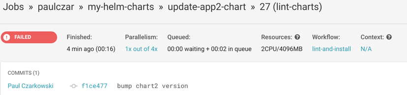
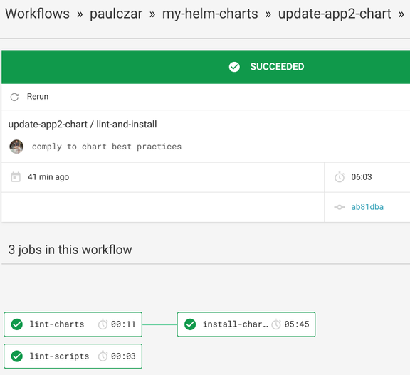
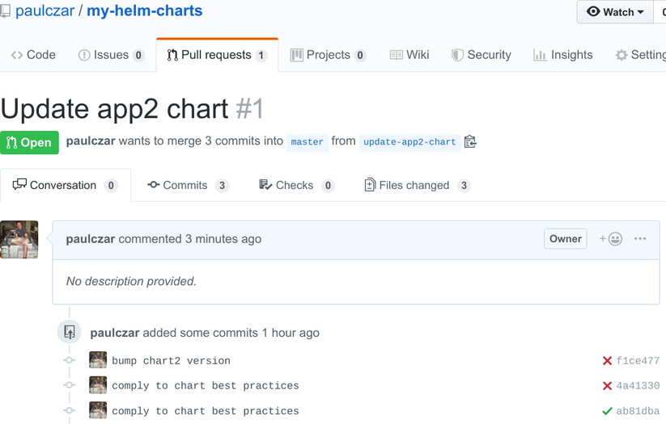

## Introduction

Welcome to a three part blog series on Creating a [Helm](https://helm.sh) Chart Repository. In [part 1](/blog/creating-a-helm-chart-monorepo-part-1) of this series I demonstrated creating a [Helm](https://helm.sh) chart repository using [GitHub](https://github.com) nd [GitHub](https://github.com) ages. In [part 2](/blog/creating-a-helm-chart-monorepo-part-2) I will add Automation to automatically update the repository, and in **part 3** I will add testing for changes to the charts themselves.

## Use Circle CI to test [Helm](https://helm.sh) Charts

> Note - You could use any other CI system here, I chose Circle as it is easy to integrate with [GitHub](https://github.com) nd has a free tier. If you do use a different CI system the scripts should still work, but you'll need to rewrite a config file suitable for your CI choice.

### Introducing Chart Testing

The [Helm](https://helm.sh) community has built a tool very imaginitively named [Chart Testing]((https://github.com/helm/chart-testing) specifically for testing [Helm](https://helm.sh) charts. Not only is it capable of linting and performing test installs of a [Helm](https://helm.sh) chart, but its also designed to work within a monorepo and only test those charts that have changed.

You can download and use [Chart Testing](https://github.com/helm/chart-testing/releases) locally, but really the power of it is using it in CI, so lets go straight to that.

### Creat a Chart Testing script and update Circle CI config

We need to add a new script, a chart-testing config file, and update the Circle CI config file.

#### [./circleci/config.yaml](https://github.com/paulczar/my-helm-charts/blob/part-2/.circleci/config.yaml)

Create two new jobs:

> These scripts and configs were heavily borrowed from [Reinhard Nägele](https://twitter.com/unguiculus) who is a primary maintainer of both [chart-testing](https://github.com/helm/chart-testing) and [chart-releaser](https://github.com/helm/chart-releaser).

The first job tells Chart Testing to lint the charts according to the [Helm](https://helm.sh) Community [Best Practices Guide](https://helm.sh/docs/chart_best_practices/).

The second job tells Chart Testing to actually install and test the charts using KIND (Kubernetes IN Docker).

```yaml
  lint-charts:
    docker:
      - image: gcr.io/kubernetes-charts-ci/test-image:v3.3.2
    steps:
      - checkout
      - run:
          name: lint
          command: |
            git remote add upstream https://github.com/paulczar/percona-helm-charts
            git fetch upstream master
            ct lint --config .circleci/ct.yaml

  install-charts:
    machine: true
    steps:
      - checkout
      - run:
          no_output_timeout: 12m
          command: .circleci/install_charts.sh
```

Add a new workflow telling Circle to lint and test any changes.

> Note: it excludes the `master` branch as we don't want to try to retest charts as they're merged in after successfully testing the new commit.:

```yaml
  lint-and-install:
    jobs:
      - lint-scripts
      - lint-charts:
          filters:
            branches:
              ignore: master
            tags:
              ignore: /.*/
      - install-charts:
          requires:
            - lint-charts
```

#### [./circleci/ct.yaml](https://github.com/paulczar/my-helm-charts/blob/part-3/.circleci/ct.yaml)

This file provides configuration for Chart Testing. For now all we need is to tell it to provide [Helm](https://helm.sh) with a longer timeout:

```yaml
helm-extra-args: --timeout 600
```

#### [./circleci/kind-config.yaml](https://github.com/paulczar/my-helm-charts/blob/part-3/.circleci/kind-config.yaml)

This file provides a configuration for KIND to use:

```yaml
kind: Cluster
apiVersion: kind.sigs.k8s.io/v1alpha3
nodes:
  - role: control-plane
  - role: worker
  - role: worker
```

#### [./circleci/install_charts.sh](https://github.com/paulczar/my-helm-charts/blob/part-3/.circleci/install_charts.sh)

Finally this script will install KIND and will perform test installations for any changed [Helm](https://helm.sh) Charts:

```bash
#!/usr/bin/env bash

set -o errexit
set -o nounset
set -o pipefail

readonly CT_VERSION=v2.3.3
readonly KIND_VERSION=0.2.1
readonly CLUSTER_NAME=chart-testing
readonly K8S_VERSION=v1.14.0

run_ct_container() {
    echo 'Running ct container...'
    docker run --rm --interactive --detach --network host --name ct \
        --volume "$(pwd)/.circleci/ct.yaml:/etc/ct/ct.yaml" \
        --volume "$(pwd):/workdir" \
        --workdir /workdir \
        "quay.io/helmpack/chart-testing:$CT_VERSION" \
        cat
    echo
}

cleanup() {
    echo 'Removing ct container...'
    docker kill ct > /dev/null 2>&1

    echo 'Done!'
}

docker_exec() {
    docker exec --interactive ct "$@"
}

create_kind_cluster() {
    echo 'Installing kind...'

    curl -sSLo kind "https://github.com/kubernetes-sigs/kind/releases/download/$KIND_VERSION/kind-linux-amd64"
    chmod +x kind
    sudo mv kind /usr/local/bin/kind

    kind create cluster --name "$CLUSTER_NAME" --config .circleci/kind-config.yaml --image "kindest/node:$K8S_VERSION" --wait 60s

    docker_exec mkdir -p /root/.kube

    echo 'Copying kubeconfig to container...'
    local kubeconfig
    kubeconfig="$(kind get kubeconfig-path --name "$CLUSTER_NAME")"
    docker cp "$kubeconfig" ct:/root/.kube/config

    docker_exec kubectl cluster-info
    echo

    docker_exec kubectl get nodes
    echo
}

install_local_path_provisioner() {
    docker_exec kubectl delete storageclass standard
    docker_exec kubectl apply -f https://raw.githubusercontent.com/rancher/local-path-provisioner/master/deploy/local-path-storage.yaml
}

install_tiller() {
    echo 'Installing Tiller...'
    docker_exec kubectl --namespace kube-system create sa tiller
    docker_exec kubectl create clusterrolebinding tiller-cluster-rule --clusterrole=cluster-admin --serviceaccount=kube-system:tiller
    docker_exec helm init --service-account tiller --upgrade --wait
    echo
}

install_charts() {
    docker_exec ct install
    echo
}

main() {
    run_ct_container
    trap cleanup EXIT

    changed=$(docker_exec ct list-changed)
    if [[ -z "$changed" ]]; then
        echo 'No chart changes detected.'
        return
    fi

    echo 'Chart changes detected.'
    create_kind_cluster
    install_local_path_provisioner
    install_tiller
    install_charts
}

main
```

### Commit the changes

Next up commit these new changes to your master branch:

```bash
$ git add .
$ git commit -m 'add chart testing on PRs'
$ git push origin master
```

## Test the new Automation

Create a new branch:

```bash
$ git checkout -b update-app2-chart
```

Modify the app2 `Chart.yaml` to be a new version number:

```yaml
apiVersion: v1
appVersion: "1.0"
description: A Helm chart for Kubernetes
name: app2
version: 0.1.1
```

Commit and Push the changes:

```bash
$ git add charts/app2/Chart.yaml
$ git commit -m 'bump chart2 version'
$ git push origin update-app2-chart
```

Circle CI should run tests and should fail:



This failure is because when `helm create` creates your chart, it doesn't implement all of our best practices. If you check in the Circle CI job log you'll see:

```text
Error validating data /root/project/charts/app2/Chart.yaml with schema /etc/ct/chart_schema.yaml
  home: Required field missing
```

The error is quite clear, we should have a field `home` in our `Chart.yaml`. In fact there should also be a `maintainers` field. Let's add those into both chart's `Chart.yaml` files:

```yaml
home: http://github.com/paulczar/my-helm-charts
maintainers:
  - name: paulczar
    email: username.taken@gmail.com
```

> Note: Since you're also changing App1, you should bump its version a patch level to `0.1.2`, all changes to a Chart, even non functional one should bump the chart version.

> Note: Ensure you leave a blank line at the end of the `Chart.yaml` file. I forgot to and had to resubmit.

Push these new changes:

```bash
$ git add .
$ git commit -m 'comply to chart best practices'
$ git push origin update-app2-chart
```

After a few seconds you should see the new jobs start in CircleCI and this time all three tasks should complete successfully:



It took about 6 minutes to run, because it did a full install of both Charts (as we changed them both) to a disposable KIND cluster.

> Note: Since this was a branch, the charts were not released to the Chart Repository as that job is only triggered on the `master branch`.

Next you'll want to create a pull request for this change, you can do that via the [GitHub](https://github.com) eb ui:



> Note: Since Circle CI has already tested the commits in this PR (Pull Request) it shows handy little test pass/fail marks against the commits.

Since the PR is showing as passing tests, you can go ahead and Merge it by clicking that green `Merge` button (although I like to use `Squash and Merge`).

This Merge into the `master` branch will kick off the `release-charts` workflow and after a few seconds we'll have an updated [Helm](https://helm.sh) Repository:

```bash
$ curl http://tech.paulcz.net/my-helm-charts/index.yaml
apiVersion: v1
entries:
...
...
  app1:
    name: app1
    version: 0.1.2
...
...
  app2:
    name: app2
    version: 0.1.1
...
...
```

## Testing Pull Requests

In the advanced settings of Circle CI you can tell it to automatically test Pull Requests that come from forks of your [GitHub](https://github.com) epository. Adding this is a great feature if you want others to work on your code with you. However you do need to protect your secrets.

For example a bad actor could add "echo $CH_TOKEN" to one of the scripts and steal my [GitHub](https://github.com) oken which they could then use to mess with my Repositories.

For that reason I've opted not to include that in this example.

## Conclusion

In [Part 1](/blog/creating-a-helm-chart-monorepo-part-1) we created set of [Helm](https://helm.sh) Charts managed in source control (GitHub).

In [Part 2](/blog/creating-a-helm-chart-monorepo-part-2) we added automation via CircleCI to automate building and deploying Chart packages to a [Helm](https://helm.sh) Chart Repository hosted in [GitHub](https://github.com) ages and [GitHub](https://github.com) eleases.

In **Part 3** we added further automation to test changes in those [Helm](https://helm.sh) charts and to pass them through rigorous testing before allowing them to be merged into the `master` branch.
