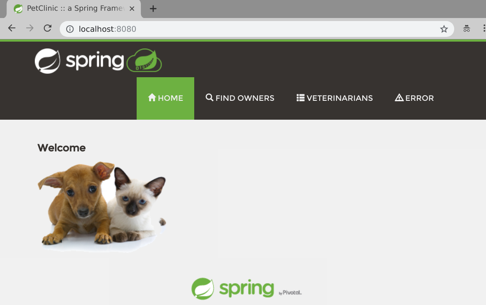
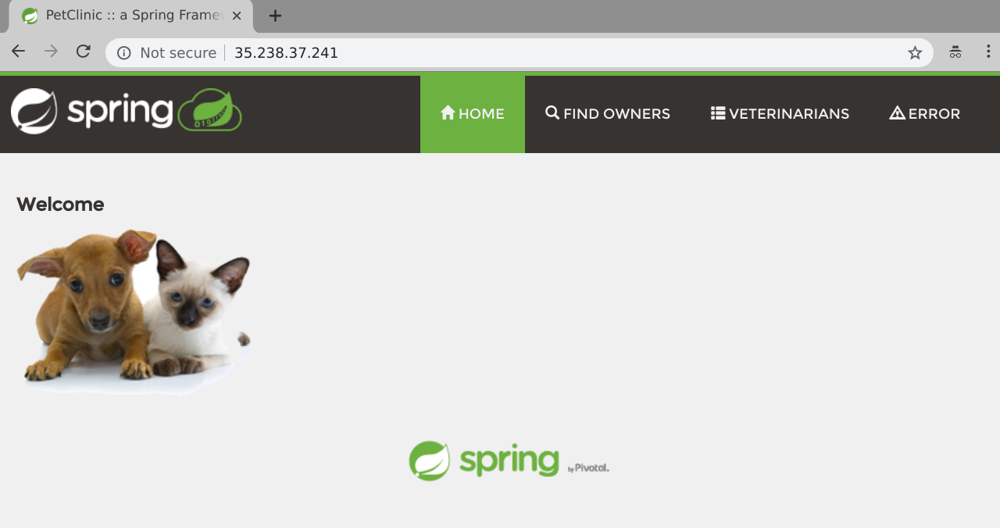

# Introduction

Welcome to the first part in a series of blog posts looking at running Spring applications on Kubernetes. To kick the series off we're going to take a look at the [Spring Pet Clinic](https://github.com/spring-projects/spring-petclinic) example application and demonstrate how we can quickly and easily get it running on Kubernetes.

# Step 1.  Install a Kubernetes

Before we get started I would encourage you to read (or at least skim) through Kelsey Hightower's seminal [Kubernetes The Hard Way](https://github.com/kelseyhightower/kubernetes-the-hard-way) to get an idea for the complexity of installing and operating a Kubernetes cluster.

Once you've done that you should be thoroughly discouraged from installing Kubernetes. That's a good thing! Most people should have no need to run their own production grade Kubernetes cluster. Every major public cloud has a Kubernetes service, and Pivotal provides the [Pivotal Container Service](https://pivotal.io/platform/pivotal-container-service) to ease the burden of installing and managing Kubernetes in your own Datacenter.

I'll be using [Pivotal Container Service](https://pivotal.io/platform/pivotal-container-service). You should be able to use any flavor of Kubernetes to follow along with this series of blog posts. The simplest way to do so is to probably install and run [Minikube](https://kubernetes.io/docs/tasks/tools/install-minikube/) which will give you a single node Kubernetes cluster running in a VM on your laptop.

# Step 2. Validate your Kubernetes cluster is ready

However you got your Kubernetes cluster is between you and your deity of choice and I won't ask any questions. You should have received [or had one automatically created] a Kubernetes config file and you should have downloaded the `kubectl` command line tool.

Run the following commands to ensure that your Kubernetes config and cluster are working correctly:

```console
$ kubectl version
kubClient Version: version.Info{Major:"1", Minor:"13", GitVersion:"v1.13.2", GitCommit:"cff46ab41ff0bb44d8584413b598ad8360ec1def", GitTreeState:"clean", BuildDate:"2019-01-10T23:35:51Z", GoVersion:"go1.11.4", Compiler:"gc", Platform:"linux/amd64"}
Server Version: version.Info{Major:"1", Minor:"12", GitVersion:"v1.12.4", GitCommit:"f49fa022dbe63faafd0da106ef7e05a29721d3f1", GitTreeState:"clean", BuildDate:"2018-12-14T06:59:37Z", GoVersion:"go1.10.4", Compiler:"gc", Platform:"linux/amd64"}

$ kubectl get nodes
NAME                                      STATUS   ROLES    AGE     VERSION
vm-16ff7fc4-88fa-406d-5f6a-7ccc92286c08   Ready    <none>   2d11h   v1.12.4
vm-5bfb8f6e-d715-45ba-77df-047447995ac1   Ready    <none>   2d11h   v1.12.4
vm-c2c16e34-1a73-4a78-50b4-bdec12d3de77   Ready    <none>   2d11h   v1.12.4
```

looking great! Create a namespace to work in that you can delete when finished to easily clean up after the demo.

```console
$ kubectl create namespace spring-into-kubernetes-1
namespace/spring-into-kubernetes-1 created
```

Update your Kubernetes config to use this new namespace by default:

```console
$ kubectl config set-context $(kubectl config current-context) --namespace=spring-into-kubernetes-1
Context "cluster1" modified.
```

# Step 3. Build a Docker image for Spring Pet Clinic

> Note: If you are using minikube you can use the [minikube docker socket](https://github.com/kubernetes/minikube/blob/master/docs/reusing_the_docker_daemon.md) and skip pushing the image up to a registry.

> Note: If you don't want to build your own image you can use the one that I've already built `paulczar/petclinic:spring-k8s-1` and skip straight to running it.

Use `git` to clone down the Spring Pet Clinic git repo locally:

```console
$ git clone https://github.com/spring-projects/spring-petclinic.git
Cloning into 'spring-petclinic'...
remote: Enumerating objects: 7860, done.
remote: Total 7860 (delta 0), reused 0 (delta 0), pack-reused 7860
Receiving objects: 100% (7860/7860), 6.99 MiB | 14.57 MiB/s, done.
Resolving deltas: 100% (2908/2908), done.

$ cd spring-petclinic
```

Ordinarily you'd use `docker build` to create a docker image, however this repo does not have a `Dockerfile`, thankfully we have a way through maven to do this using the [Google JIB project](https://github.com/GoogleContainerTools/jib):

```console
$ mvn compile -Dimage=spring/petclinic:spring-k8s-1 \
    com.google.cloud.tools:jib-maven-plugin:1.0.0:dockerBuild
...
...
[INFO] Built image to Docker daemon as spring-petclinic:2.1.0.BUILD-SNAPSHOT
[INFO] Executing tasks:
[INFO] [==============================] 100.0% complete
[INFO]
[INFO] ------------------------------------------------------------------------
[INFO] BUILD SUCCESS
[INFO] ------------------------------------------------------------------------
[INFO] Total time: 20.561 s
[INFO] Finished at: 2019-01-24T08:56:30-06:00
[INFO] ------------------------------------------------------------------------
```

This will have built an image called `spring/petclinic:spring-k8s-1`. Verify it:

```console
$ docker images spring/petclinic:spring-k8s-1
REPOSITORY          TAG                    IMAGE ID            CREATED             SIZE
spring/petclinic    spring-k8s-1   6afb36ee7749        15 seconds ago        164MB
```

Tag this image for your Docker registry username (anywhere you see my registry username you should swap it for yours) and push it up:

```console
$ docker tag spring/petclinic:spring-k8s-1 paulczar/petclinic:spring-k8s-1
$ docker push paulczar/petclinic:spring-k8s-1
The push refers to repository [docker.io/paulczar/petclinic]
1f5a2dd7582f: Layer already exists
6e01ddadb469: Pushed
185699264bb4: Layer already exists
5b0bbc8b30cc: Pushed
6189abe095d5: Pushed
c5204564c844: Pushed
spring-k8s-1: digest: sha256:0a71768b0a3b199b6ec78dff983f26c4103e6089ed50c17985b58c120c3aaf72 size: 1581

```

# Step 4. (optional) Validate the Docker Image works locally

It's usually a good idea to validate things locally in Docker before moving ahead, so go ahead and do that by running Spring Petclinic via your local docker daemon:

> Note: We're running docker with the `-ti` flag to keep it in the foreground, `--rm` to delete the container when done and `-p` to map a port from localhost.

```console
$ docker run -ti --rm -p 8080:8080 paulczar/petclinic:spring-k8s-1
...
...
2019-01-24 15:07:35.928  INFO 1 --- [  restartedMain] o.s.b.a.e.web.EndpointLinksResolver      : Exposing 15 endpoint(s) beneath base path '/manage'
2019-01-24 15:07:36.057  INFO 1 --- [  restartedMain] o.s.b.w.embedded.tomcat.TomcatWebServer  : Tomcat started on port(s): 8080 (http) with context path ''
2019-01-24 15:07:36.061  INFO 1 --- [  restartedMain] o.s.s.petclinic.PetClinicApplication     : Started PetClinicApplication in 7.151 seconds (JVM running for 7.522)
```

Validate it works by pointint your web browser at localhost port 8080:



Stop and delete your running container by hitting `control c` in the terminal running the docker image.

# Step 5. Run Pet Clinic in Kubernetes

There are two main ways of interacting with Kubernetes. __declarative__ and __imperative__. With declarative you run `kubectl apply` with a local copy of the Kubernetes manifest and let Kubernetes determine how to ensure the running resources matches. When you use Kubernetes imperatively you give it more precise commands like `kubectl create` and `kubectl run`.

Most advanced users of Kubernetes use the declarative methods, but the imperative are perfect for when you're just getting started or want to do something quickly.

Create a Kubernetes deployment by running the `kubectl run` command and then validate it with `kubectl get all`:

```console
$ kubectl run petclinic --image=paulczar/petclinic:spring-k8s-1
deployment.apps/petclinic created

$ kubectl get all
NAME                             READY   STATUS    RESTARTS   AGE
pod/petclinic-5ffccf75c4-snhdd   1/1     Running   0          36s

NAME                        DESIRED   CURRENT   UP-TO-DATE   AVAILABLE   AGE
deployment.apps/petclinic   1         1         1            1           36s

NAME                                   DESIRED   CURRENT   READY   AGE
replicaset.apps/petclinic-5ffccf75c4   1         1         1       36s
```

You can see that Kubernetes has created several resources. It created a __Deployment__ which is a Kubernetes controller for managing the lifecycle of __ReplicaSets__. The __Deployment__ created the __ReplicaSet__ which is a controller for ensuring a set number of replicas of your application is running. The __ReplicaSet__ created a __Pod__ which is your running application.

You might notice that the Kubernetes output above does not give you an IP address or any hints as to how to access your application. This is because we need to expose the application using a __Service__ resource.

# Step 6. Expose your application to the Internet

If you don't care about making your application available to the internet and just want to validate that it works you can run `kubectl port-forward` and access your application via a `localhost` port forward like so:

```console
kubectl port-forward deployment/petclinic 8080:8080
Forwarding from 127.0.0.1:8080 -> 8080
Forwarding from [::1]:8080 -> 8080
```

Access the petclinic app just like we did earlier by pointing your browser at localhost:8080:


Stop the port forward with a `control-C` on in the terminal.

Use the `kubectl expose` command to create a LoadBalancer service in Kubernetes and then validate it with `kubectl get services`:

```console
$ kubectl expose deployment petclinic --type=LoadBalancer --port 80 --target-port 8080
service/petclinic exposed

$ kubectl get service
NAME        TYPE           CLUSTER-IP       EXTERNAL-IP   PORT(S)        AGE
petclinic   LoadBalancer   10.100.200.110   <pending>     80:31148/TCP   15s
```

After a few minutes the `EXTERNAL-IP` field should go from `<pending>` to having an IP address:

```console
$ kubectl get service
NAME        TYPE           CLUSTER-IP       EXTERNAL-IP   PORT(S)        AGE
petclinic   LoadBalancer   10.100.200.110   35.238.37.241    80:31148/TCP   15s
```

> Note: If you are running minikube you won't get a real loadbalancer and can run `minikube service example-service --url` to get an IP/Port combo that should work.

Point your web browser at that IP address on port 80:



# Step 7. Cleanup

Delete the service and deployment by running the `kubectl delete` command:

```console
$ k8s-platform-ops kubectl delete deployment petclinic
deployment.extensions "petclinic" deleted
$ k8s-platform-ops kubectl delete service petclinic
$ k8s-platform-ops kubectl get all
No resources found.
```

Delete your namespace and switch back to the `default` namespace:

```console
$ kubectl delete namespace spring-into-kubernetes-1
namespace "spring-into-kubernetes-1" deleted

$ kubectl config set-context $(kubectl config current-context) --namespace=default
Context "cluster1" modified.
```

# Conclusion

Congratulations! You've successfully deployed a basic Spring application to Kubernetes and it wasn't even all that hard.

Using Kubernetes imperatively like this is a great way to get started and easily demonstrate running an application on Kubernetes. Of course there's many more things to take into consideration if you want to run an application in production on Kubernetes and we'll explore some of those things in future installments of Spring Into Kubernetes.
