I recently had the privilege to help organize DevOpsDays Texas 2021 a virtual event that we ran to try and scratch our DevOpsDays itch given that in-person conferences won't be happening any time soon.

To see the final product you can watch the [Day 1](https://www.youtube.com/watch?v=Ji_Dl92D6ps) and [Day 2](https://www.youtube.com/watch?v=AvuWHRPqcCA) streams over on [youtube](https://www.youtube.com/channel/UC4KuCn1Fy1tgt9NRIN3rlFg).

I had the misfortune of being the most experienced at OBS setup for live streaming and therefore was nominated as the person to figure out how to live stream the event to Youtube.

I chose to use [Open Broadcaster Software (OBS)](https://obsproject.com/) to manage the stream and Windows as the OS to run it on (OBS support is generally best on windows).

## Setting up the streaming box

I already have a pretty decent streaming box at home, its a couple year old Dell workstation that I added an SSD and a Nvidia GTX 1050 ti. The most important component of an OBS machine is that it contains something capable of doing h.264 encoding in hardware, otherwise the CPU will be blasted.

The 1050ti is a few years old, but still supports `nvenc` which is the Nvidia library for doing hardware encoding. One important thing to note is that for `nvenc` to work you must have a display hooked up to the card. This means you cannot use the Windows Remote Desktop tool as it swaps out the display for a virtual one.

I use NoMachine as a remote desktop tool to connect to my streaming box and I have a [cheap HDMI dummy monitor](https://www.amazon.com/Headless-Display-Emulator-Headless-1920x1080-Generation/dp/B06XT1Z9TF/) which tricks the GPU into thinking it has a monitor plugged in.

I then installed [OBS Studio 26.1.1](https://obsproject.com/download) and two OBS plugins [Audio Monitor](https://obsproject.com/forum/resources/audio-monitor.1186/) and [Advanced Scene Switcher](https://obsproject.com/forum/resources/advanced-scene-switcher.395/) which I'll detail later.

Knowing that I would need to do some advanced audio work I also downloaded [VB-Cable Virtual Audio Device](https://vb-audio.com/Cable/) to use to ensure I could get audio from Zoom to OBS. For previous streams I've needed more cables and have used their A+B and C+D cable packs as well as [Voicemeeter Banana](https://vb-audio.com/Voicemeeter/banana.htm) for mixing the audio, but for this event I was able to get by with just the one Cable.

I knew I would want to run a backup streaming server in the cloud so I kept all my files in a sensible path `c:\obs\dod-tx` which meant I could export profiles and scene collections, copy up the whole thing and import them from the same location on the streaming server.

[IBM Cloud](https://ibm.com/cloud) kindly offered to provide us with a dedicated GPU server which we gladly took them up on. Unfortunately they did not have a Dummy HDMI monitor dongle so I was unable to take advantage of the GPU, but the CPU onboard was powerful enough to handle the encoding.

Knowing that I would need to keep files in sync between the two servers I looked into the state of the art for copying files between windows servers securely over the internet. To my chagrin I found no great answer and ended up doing something that I haven't done in fifteen or more years, installing [Cygwin](https://www.cygwin.com/) and rsync. I'm sure there is something better out there, but at least this gave me the ability to sync `c:\obs\dod-tx` between the two machines over SSH which is secure enough for me.

## OBS Plugins

### Audio Monitor

[Audio Monitor](https://obsproject.com/forum/resources/audio-monitor.1186/) is a plugin that allows you to apply one or more **Audio Monitor** plugins to any audio feed in OBS. For each audio source we set up two Audio Monitors, one to a set of headphones, the other to the VB Virtual Audio Cable which we could route to the Microphone source in Zoom and OBS.Ninja.

### Advanced Scene Switcher
[Advanced Scene Switcher](https://obsproject.com/forum/resources/advanced-scene-switcher.395/) is a plugin that lets you automate OBS changing scenes based on a number of triggers such as the current time, or when a media source finishes playing.

## OBS Overlay and Underlay Scenes

In OBS you create a Scene that contains one or more sources that are layered on top of each-other. You can use another Scene as a source. This means that you can compose fairly complex scenes together into the stream.

This allowed us to have a few master scenes that were the base for the rest of the scenes.

We had a basic Interstitial (that's a big word, I think I'm using it right) scene that consisted of a basic background which we could add into a specific scene with a text source over the top of it. This was used for breaks to show what was coming up next etc.

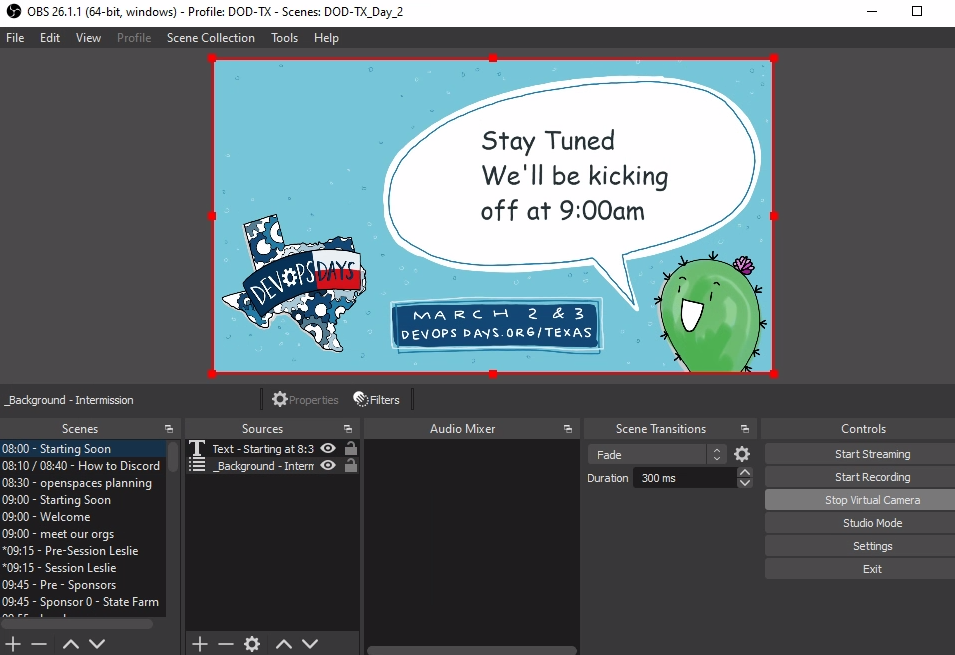
_This shows our starting soon scene which contains the interstitial scene and a text source that says "stay tuned we'll kick off at 9am"._

## The Conference Schedule

Obviously to build out DOD TX scene collections I needed to first determine the schedule. Thankfully we'd had a very successful CFP and we had two Keynotes, eleven 30-minute Sessions, two panels (which we called fire starter chats), thirteen 5-minute Ignites, and twelve sponsor pitches. We also had opening and closing messages for each day, speaker introductions, and a couple of how-to videos scheduled during breaks etc.

Most of the content was pre-recorded and we asked Speakers, Ignites, and Sponsors to provide 1920x1080 resolution videos. Quite a number of the speakers used Zoom or similar to do their recordings and we ended up with a lot of videos that were _not quite_ 1080p. This is relatively easy to fix with OBS, so it wasn't a big deal.

We did however want to do the closing  messages live each day, and the fire-starter chats were live, so we had two all day Zoom meetings that we could capture the audio/video from for those. Much to our annoyance, Zoom does require at least two people in a meeting at all times or it will eventually time the meeting out. This happened to us a few times, however we could just re-open the same meeting so it wasn't a big deal.

## Captions and Live Drawing

We knew that we wanted to ensure the conference was accessible so we opted to hire [White Coat Captioning](https://whitecoatcaptioning.com/) to do live captioning and we also hired Ashton from [Minds Eye Creative](https://www.mindseyecreative.ca/) to do a live drawing of the contents of each 30-minute session.

### OBS.Ninja pre-stream feed

I needed a way to get our conference audio/video live to both parties, Streaming services usually add some delay for processing to a stream, so it was important that we were able to provide them with an un-delayed live video/audio feed. I could have used Zoom, but I was already going to use that for live content, therefore I opted to do this with a web based [obs.ninja](obs.ninja) room.

In OBS Ninja I shared the OBS virtual camera and VB Virtual Audio Cable from the Control room. Both the captioning team and Ashton would connect to this and able be able to see and hear the live feed from OBS without any delays, plus broadcast their own video/audio (if needed) to be captured as a Browser source in OBS.

### Live Drawing

When Connected Ashton would see and hear the OBS feed live, and would share her camera/desktop via a custom receive URL.

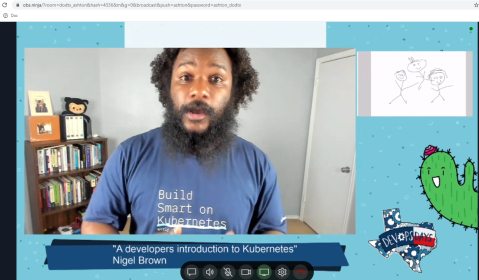

_Ashton's view of the conference, when a session is running she sees the live video from OBS which includes the session video as well as her own screenshare, so she has a preview of what the live stream will see._

I then created a Scene in OBS called `_ashton - drawing` which contained two sources, and Image that would be displayed if Ashton's feed was offline and Ashton's OBS.ninja feed to which she shared her screen focussed on her drawing app.

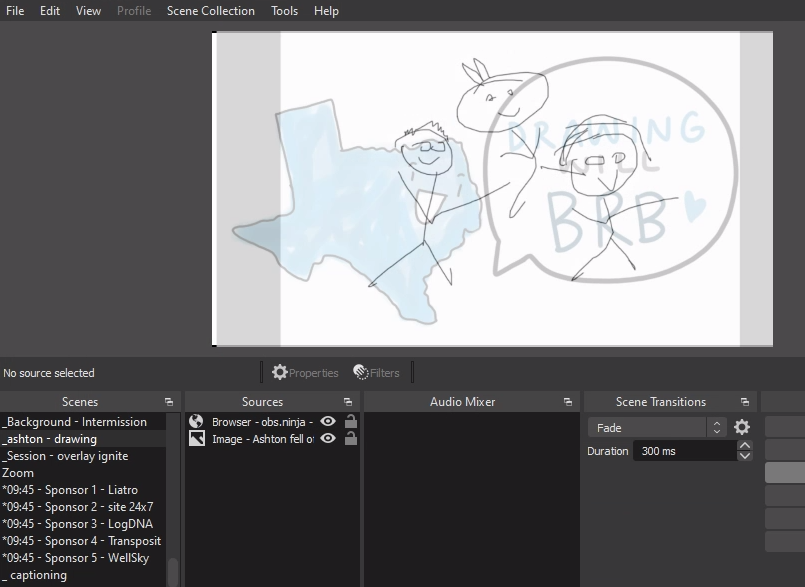

_The OBS Scene containing Ashton's cartoon.  I've added a touch of transparency to her source so that you can faintly see the image behind it that would show if she was offline. During the conference this was totally opaque._

### Captions

The captioning team would see exactly the same feed as Ashton above. However we didn't want to capture anything directly from White Coat, instead they send a text stream to a [streaming text](https://www.streamtext.net) website. The website would show an auto-scrolling wall of text as the captionering team did their thing. I created an OBS Scene that contained a Browser source pointing at the text stream like so.

> Note: There is an [OBS websocket plugin](https://github.com/EddieCameron/obs-websocket-streamtext-captions) to create a better interface to capturing from streamtext, but it involves setting up a NodeJS service and I didn't want climb that particular hill.

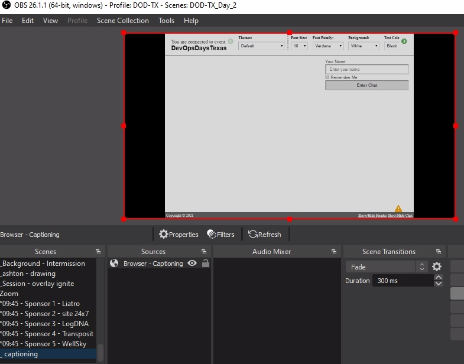
_The captions scene shows the whole stream text website._

The captioning team would blast carriage returns at the start of each day to ensure that when the captioning started it would be on the last two lines and the auto-scrolling would keep it there. This means we can add the `_captioning` scene above as a source into any scenes that we wished to display the captions and crop the source to show just the last two lines of the source.

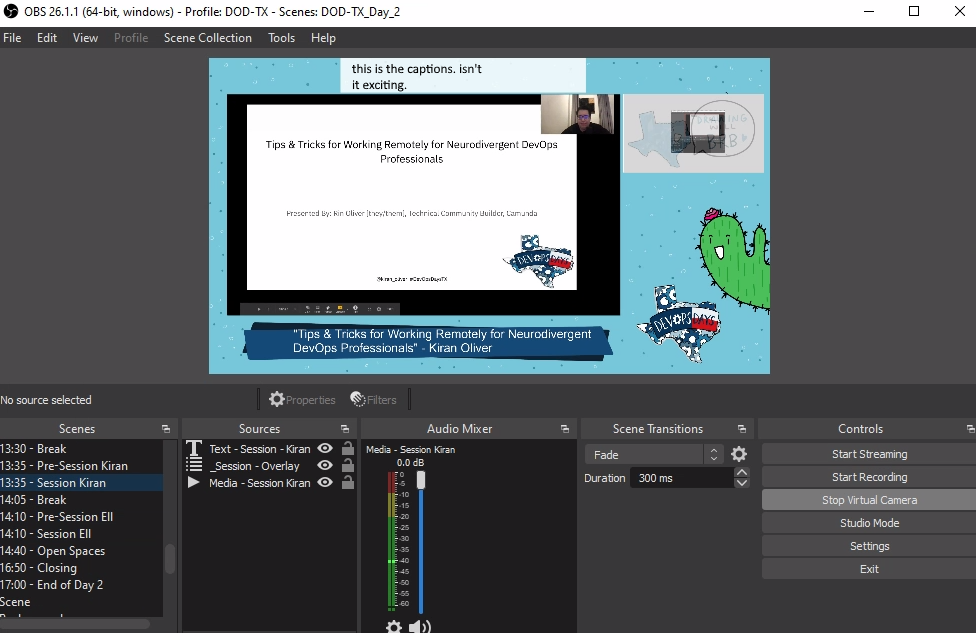

_The captions thus appear in a captions bar across the top of any scenes that we wanted captioned._

## Live Sessions - Zoom

In order to facilitate live sessions I chose to use Zoom. I could have used OBS.Ninja like above, however that would have required a bunch of extra work vs doing the basic window-grab of Zoom.

I created a Zoom scene in OBS in which I added a Window source for Zoom, a "technical difficulties" source under the Zoom source (so it would show if zoom crashed or whatever) and an Audio Input source for the Virtual Audio Cable.

I used the CTRL-Drag of the bounding box for the Zoom source to cut out the borders and controls of the zoom window to make it look a little less "zoomy".

I also configured Zoom to use the Virtual Audio Cable as the speaker, I wouldn't be sending audio to Zoom so I just left the Mic on the default setting, but I could have used a second Virtual Audio Cable to route audio from OBS to Zoom's Mic.

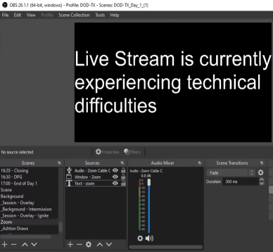

_With Zoom not currently running the technical difficulties message is shown._

I scheduled two all-day Zoom calls and shared the invite links to the people giving live sessions. Apart from keeping the meeting open and ensuring the right people were on Zoom at the right time there was very little effort required.

## Content Scenes - Sessions, Ignites, etc

With the plumbing out of the way I could start building out Scenes for the Sessions, Ignites, Sponsors, etc. Given the even was time based I made the decision to prefix each scene with the time that I expected to play it.

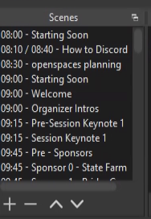

_By prefixing the scenes with their times it was obvious from the OBS interface what scene to play when and helped ensure the scenes were ordered chronologically._

We wanted to make sure that folks had plenty of chances for breaks, so we chose to sandwich all content with some sort of short break, usually 5 minutes at a time, as well as a longer break for lunch. We also wanted to ensure that we had a variety of content so we tried not to have two pieces of similar content in a row.

We had captions and live drawing for our Keynotes and main sessions, but not for other content such as Ignites and Sponsor pitches. So I built two main overlays.

### Keynote and Session Scenes

The Keynote and Session overlay was a scene that started with a graphics source that was had a border with DOD TX colors and graphics (designed by the talented Ashton) with a blank title bar at the bottom and a transparent rectangle (16:9 ratio to match 1080p videos).

I added a text source to point viewers to our sign-up url so they could get access to discord, as well as the captions scene at the top of the window and the live drawing scene on the right.

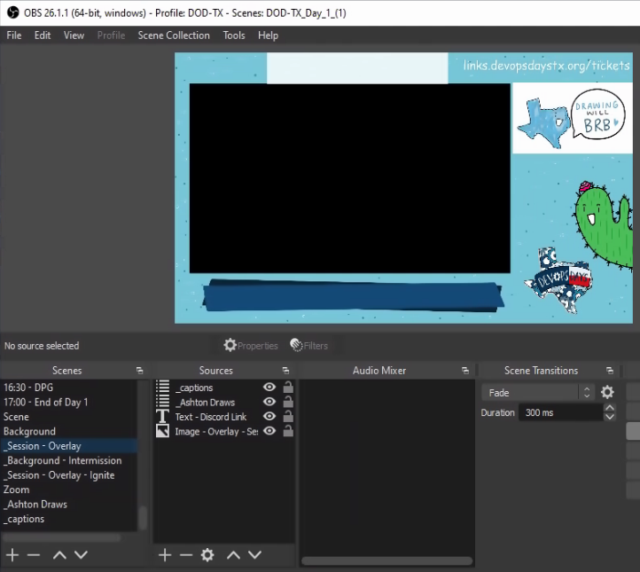

_Here you can see the blank session overlay Scene._

I then created individual scenes per Keynote and Session that started with the main content source, in most cases a media source that contained the pre-recorded session video. By default I added both the Compression and Noise Suppression filters to the videos (this helped a ton with background noise and substandard microphones) and 2 x Audio Monitor filters (one for OBS ninja, one for headphones) to ensure sound got to where it needed to go. I also skimmed through the video and made sure sound was high green to mid orange at peak and adjusted the gain to suit.

Next I added the Session overlay and adjusted the Video media to fit inside the virtual frame of the overlay. If the video source wasn't perfectly 16:9 I made the video slightly bigger than the transparent part of the overlay and let it  crop off the edges.

> Note: you can copy transforms and filters from one source to another, this made it very easy to make the videos consistently sized.

Finally I added a text overlay that went over the title bar to add the Session title and speaker name.

_The result was a consistent look across all sessions with branding, captions, and live drawing._

### Ignite, and Sponsor pitch overlay

This overlay was very similar to the Session overlay, only without the captioning or live drawing (although I did go back and add the captioning source to the ignite scenes later).

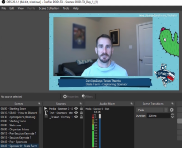

_Here you can see the simpler overlay used for Ignites and Sponsor pitches_

## Transition Scenes

With the majority of the content scenes out of the way, it was time to build out transition scenes. I knew I would need some text focussed transition scenes like "Stay tuned we'll be kicking off at 9:00am" and "break time! next up..." as well as introduction transition scenes to play personalized introduction videos for our sessions.

### Text based Transition Scenes

The text based transitions were fairly straight forward. I had Ashton build me a 1080p image with a big space for text. She created a brilliant image with a cactus (one of the recurring DOD Texas characters she created) and a speech bubble.

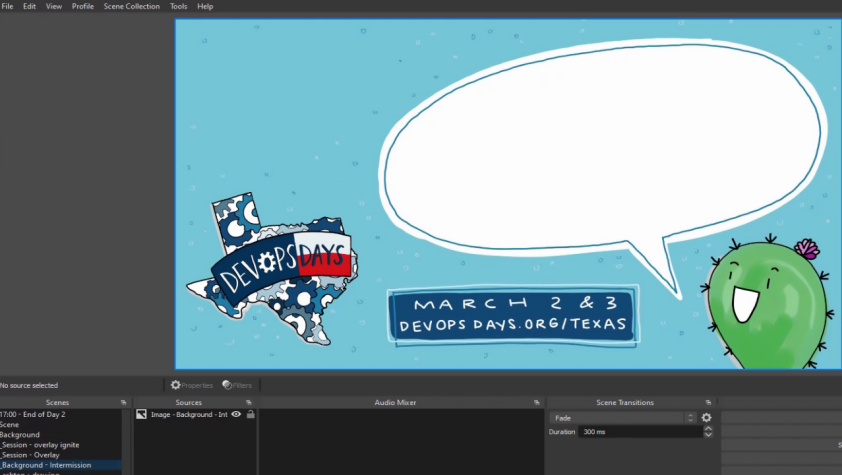

_Here you can see the text base transition scene._

I created a Scene for Starting Soon, Finished, Breaks, and a few other transitions that included the base intermission scene and then added some text in everyone's favorite font.

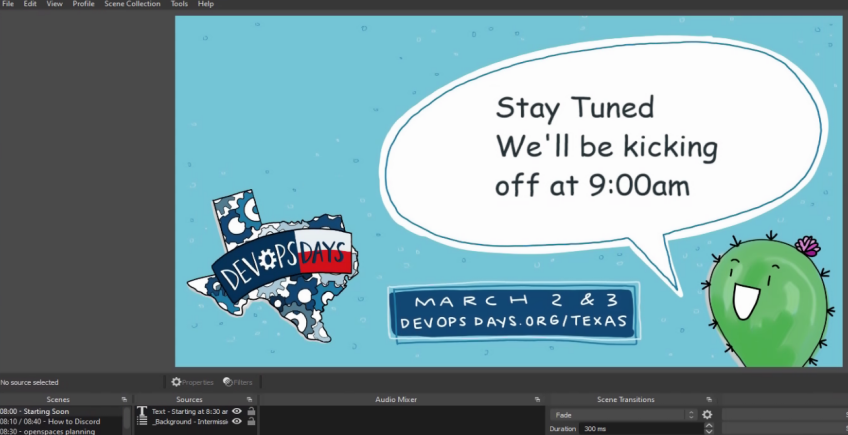

_Here you can see the starting soon transition scene with the text overlayed over the base scene._

### Speaker Introductions

We also wanted to create personalized speaker introductions, Dan Collins and Laura Santamaria volunteered to record a roughly 1 minute introduction for each speaker, and did an amazing job of it, their experience in creating compelling videos really shone through.

Ashton had created social cards for each speaker to be used on various social media platforms to promote their session, so I collected those and use them as a background for each speaker introduction, and then I layered the introduction video on top of it, that way when the video ended it would show the speaker's avatar and session title while I fumbled to switch to the scene for that session.

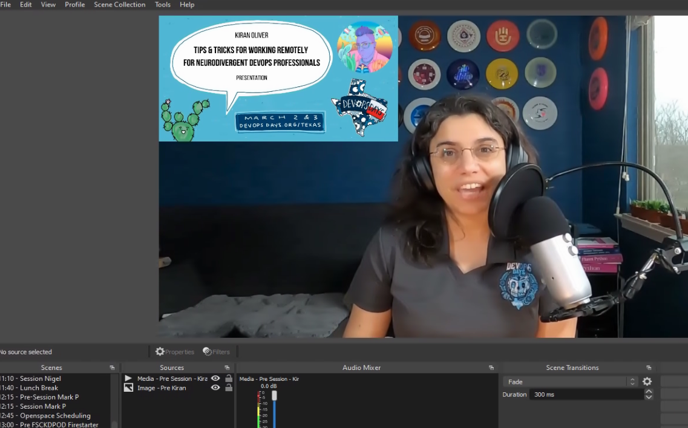

_Here you can see Kiran's introduction done by Laura, Laura included the social card in her videos too, so we had a really great transition experience._

## Automating Scene Transitions

By this stage I had two scene collections set up one for Day 1, one for Day 2. Each scene collection had the scenes that consisted of the day's event listed in the order in which they were to be played and prefixed with the times that they should be played.

When I was setting this up originally I had expected that I would be setting alarms and clicking between each scene. However I stumbled across the [Advanced Scene Switcher](https://obsproject.com/forum/resources/advanced-scene-switcher.395/) OBS plugin that allowed you to set various triggers to switch between scenes.

The triggers I used were "Media", "Time", and "Sequence".

Initially I was going to use _Time_ based triggers for the whole event, but I discovered that since most of our content wasn't exactly timed (Session videos were slated for 30 minutes, but most were around 25 minutes, and some were event less) which meant that when a Session video finished it would stay on an empty session scene until the time was up.

To combat this, I switched most of the triggers to be _media_ based and set the action to be "When Media **session - Nigel** state is **Played to end** switch to **11:40 - Lunch Breaks** scene.

_Here you can see the lengthy list of media based switches that drove most of the automated scene switching._

This was perfect as we had some form of break after every session, so if a session finished early it would immediately transition into the specific Break's transition scene and we'd just get a slightly longer break.

This means that _Time_ based switching was used to trigger the scheduled content such as "at **10:35** switch to **10:35 - Ignite Intro** and the _Media_ based switching was used to trigger the transition scenes.

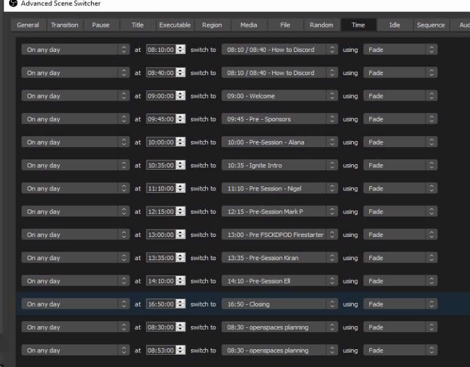

_Here you can see the Time based switches that drove the scheduled scenes._

I also had a few text based introduction scenes like the above mentioned **10:35 - Ignite Intro** which I solved with the _Sequence_ based triggers such as "When **10:35 - Ignite Intro** is active switch to **10:35 Ignites - Jeremy** after **10 seconds**".

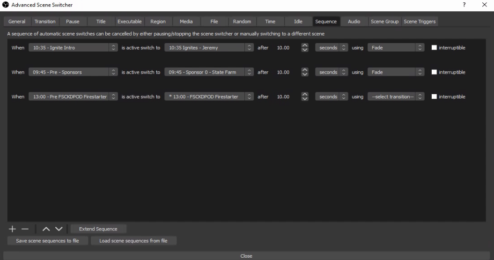

_Finally here's the sequence switches._

With these in place, both days were fully automated, the only thing I had to do was hit "Start Streaming" and "Stop Streaming" at the start and end of each day.

## The actual streams

A few days prior to the events I had the both days fully automated, and was able to test them on unpublished youtube streams. This gave us the opportunity to preview the streams and fix any issues. We found a few, but not all of the issues.

I also used rsync to make sure that the content was synced to the IBM Cloud server and I had exported and imported the scene collections so that I could drive the event from the cloud server and fall back to my personal streaming box in emergency.  I also gave JJ Asghar a quick rundown on what to do in case I lost power or got hit by a falling aircraft engine.

On both days of the event I set the **8:00 Starting Soon** scene as active hit the start streaming button at 8:00am. From here I just had to monitor things and hope I got the automation right, If not, I could always override it.

The event was not without a few glitches. Somewhere I had managed to schedule it to **Start Recording** part way through the first session. The streaming server had just a single slow disk and this action caused the stream to stutter and have issues. On the first day it took a while to figure out what went wrong and fix it. We nearly switched to my backup streaming box when I saw the **Recording** was on.  Turning it off fixed it, but not before I had accidently clicked off the scene and then had to try and scrool through to the right spot in the media playback.

As we played through both days there were a few scenes that weren't quite right, and I was able to switch to **Studio Mode** which lets you edit a scene without switching to it live, which allowed me to fix most of the issues, however a few times I forgot to switch to Studio Mode and accidently switched scenes. This was a sign that unless a scene glitch is really major, better just to leave it glitched than to try and fix it live.

## Conclusion

Overall I would say that while tedious, it was actually fairly easy to build out the OBS setup to stream the event. The few live glitches we had were really stressful, but ultimately small enough that it didn't affect the overall viewing experience.

I definitely gained an appreciation of the hard work and planning that goes into the production side of an event like this, and definitely feel that if you have the budget, partnering with a production company to do this for you is well worth it.

Would I do this again? If you had asked me a few days after the event, I would say no way, but now, with some time passed, I would probably say yes.